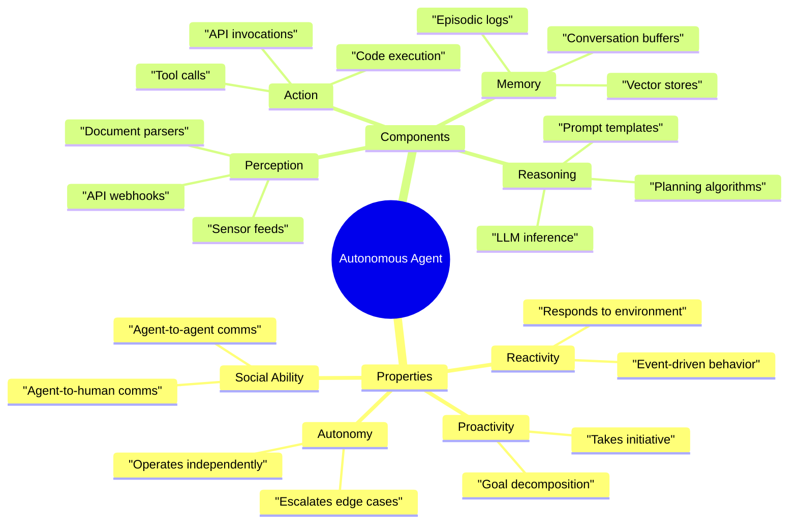
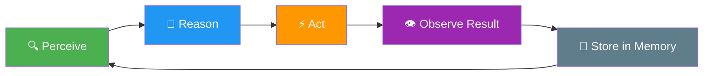
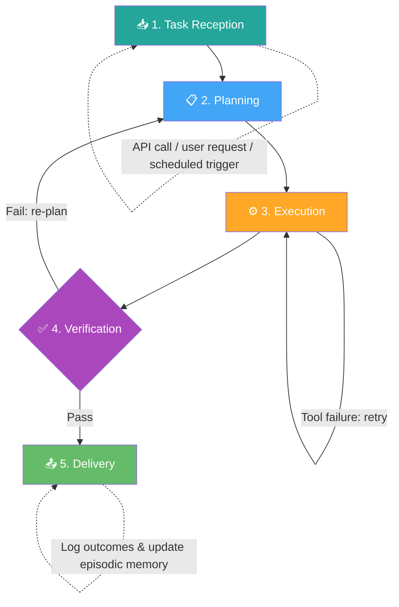
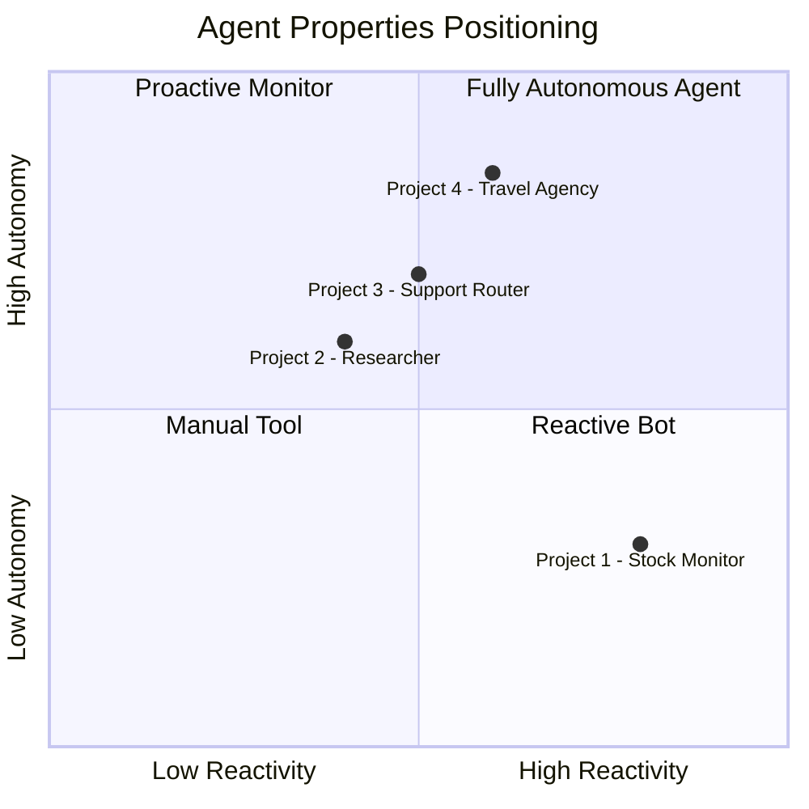
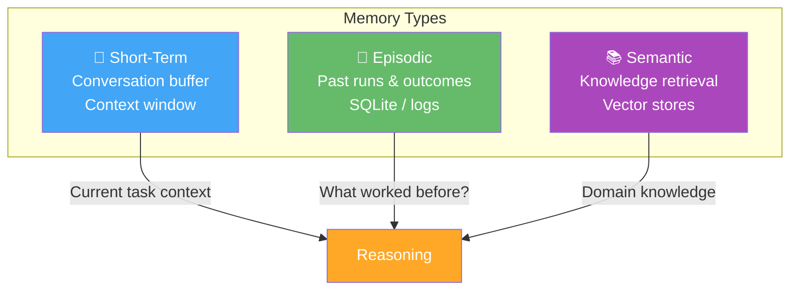

# 🧠 Learnings & Concept Reference

> A living document for revision. Contains conceptual notes, flowcharts, and insights discovered while building. **Never delete — only append.**

---

## Table of Contents
- [1. Williams' Agent Framework](#1-williams-agent-framework)
- [2. The Agent Loop](#2-the-agent-loop)
- [3. The Agent Lifecycle](#3-the-agent-lifecycle)
- [4. Agent Properties Spectrum](#4-agent-properties-spectrum)
- [5. Core Components Deep-Dive](#5-core-components-deep-dive)
- [6. Failure Modes & Anti-Patterns](#6-failure-modes--anti-patterns)
- [7. Project-Specific Insights](#7-project-specific-insights)

---

## 1. Williams' Agent Framework

Williams defines an autonomous agent through **four properties** and **four components**. The key insight is that these exist on a **spectrum** — no agent is fully autonomous or fully reactive. Production agents are tuned along these axes based on the risk and complexity of the domain.

---

## 2. The Agent Loop

The fundamental execution pattern of every agent, regardless of complexity:

### Key Insight
> Williams emphasizes that **production failures almost always trace back to a breakdown in one of the four components** rather than model capability. The model is rarely the bottleneck — it's the plumbing around it.

### Where Things Break (by component)

| Loop Phase | Component | Common Failure |
|---|---|---|
| Perceive | Perception | Missing events, wrong format, noisy data |
| Reason | Reasoning | Hallucinated plans, infinite loops, wrong tool selection |
| Act | Action | API timeout, wrong parameters, unintended side effects |
| Observe & Store | Memory | Stale context, retrieval misses, buffer overflow |

---

## 3. The Agent Lifecycle

Williams describes a 5-phase lifecycle for production agents. This is the *macro* view (the Agent Loop is the *micro* view that happens inside the Execution phase).

### Phase Details

| Phase | What Happens | Critical Question |
|---|---|---|
| **Task Reception** | Agent receives a goal (API, trigger, user) | Is the goal well-defined enough to act on? |
| **Planning** | Decompose goal → subtasks, select tools | Can the agent recover if the plan is wrong? |
| **Execution** | Iteratively call tools, process results, update plan | What happens when a tool call fails? |
| **Verification** | Evaluate output against goal criteria | How does the agent know it succeeded? |
| **Delivery** | Return results, log outcomes, update memory | Is the episodic memory useful for future tasks? |

---

## 4. Agent Properties Spectrum

Agents are not binary. Each property is a dial, not a switch.

### The Autonomy Spectrum in Practice

**Project 3** specifically explores this spectrum: the agent handles routine queries autonomously but escalates complex/risky cases to a human.

---

## 5. Core Components Deep-Dive

### Perception
- **What it does:** Transforms raw environmental data into structured information the Reasoning component can use.
- **Production implementations:** API webhooks, RSS feeds, database triggers, file watchers, user messages.
- **Key insight:** Perception is a *filter*. A good perception layer reduces noise so the Reasoning component isn't overwhelmed.

### Reasoning
- **What it does:** The "brain" — analyzes perceived information, creates plans, selects tools, makes decisions.
- **Production implementations:** LLM inference chains, prompt templates, rule engines, planning algorithms.
- **Key insight:** Reasoning is where most *visible* failures happen (hallucinations, bad plans), but the *root cause* is often bad Perception or Memory feeding it garbage data.

### Action
- **What it does:** The "hands" — executes decisions by calling tools and APIs.
- **Production implementations:** Function calling, API invocations, database writes, code execution.
- **Key insight:** Actions have **side effects**. Unlike Perception and Reasoning (which are read-only), a bad Action can cause real damage. This is why Verification exists.

### Memory
- **What it does:** Stores and retrieves context, past experiences, and knowledge.
- **Types:**
  - **Short-term / Working memory:** Current conversation buffer, in-context window.
  - **Episodic memory:** Logs of past agent runs and outcomes (SQLite, logs).
  - **Semantic memory:** Long-term knowledge retrieval (vector stores, knowledge graphs).
- **Key insight:** Memory is the most underestimated component. Without good memory, agents repeat mistakes, lose context, and can't learn from experience.

---

## 6. Failure Modes & Anti-Patterns

> Add entries here as you discover them while building.

| # | Failure Mode | Component | Description | Discovered In |
|---|---|---|---|---|
| F-001 | Infinite Alert Loop | Perception + Memory | Agent keeps alerting on the same event because memory doesn't track "already seen" | — |
| F-002 | Hallucinated Tool Call | Reasoning | Agent invents a tool name that doesn't exist | — |
| F-003 | Plan Decomposition Failure | Reasoning | Agent creates a plan with steps it cannot actually execute | — |
| F-004 | Stale Context | Memory | Agent uses outdated information from an old conversation | — |
| F-005 | Overconfident Autonomy | Action | Agent takes a high-risk action without verification or escalation | — |

---

## 7. Project-Specific Insights

> Append learnings here as each project progresses.

### Project 1 — Stock/News Monitor
_No insights yet. Will be populated during development._

### Project 2 — Deep-Dive Researcher
_No insights yet._

### Project 3 — Customer Support Router
_No insights yet._

### Project 4 — Travel Agency
_No insights yet._
