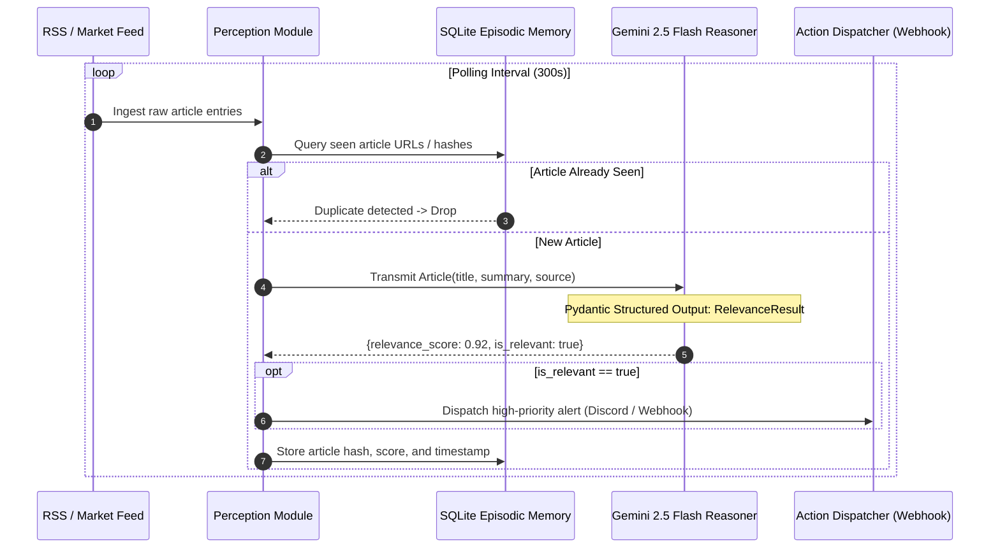
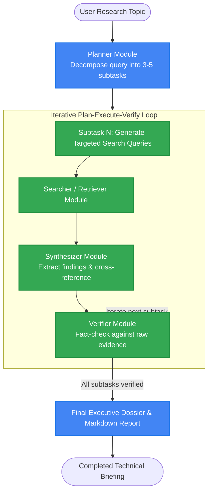
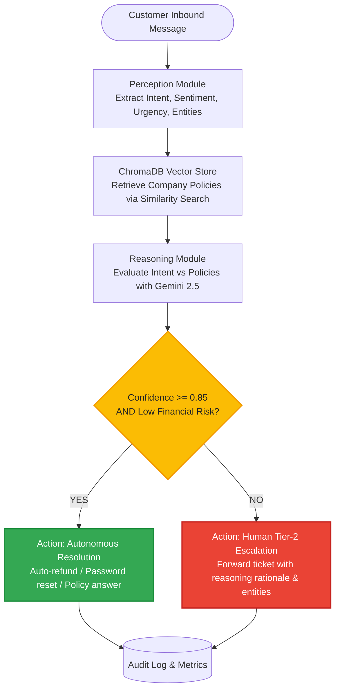
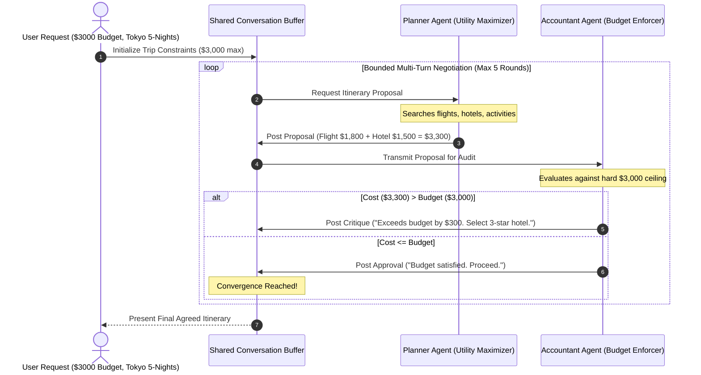

# Applied AI Agent Architecture Lab: 4 Production Agent Archetypes

[](https://www.python.org/downloads/)
[](https://ai.google.dev/)
[](https://en.wikipedia.org/wiki/Intelligent_agent)
[](https://www.trychroma.com/)
[](https://opensource.org/licenses/MIT)

> **Engineering Design Document & Production Reference Implementation**  
> *Author:* **Ishan Dhiman** ([@BigBro2454](https://github.com/BigBro2454))  
> *Target Architecture:* Google Cloud AI / Vertex AI Multi-Agent Systems / Applied AI Product Management

---

## 1. Executive Summary & Systems Problem Statement

Enterprise AI applications routinely fail when engineering teams treat Generative AI as a monolithic text completion box. Real-world business challenges require **autonomous, resilient, and specialized agentic architectures** operating across distinct operational regimes:

* **Unattended Monitoring**: Continuous observation without runaway token consumption or hallucinated alarms.
* **Complex Multi-Step Synthesis**: Structured decomposition of vague instructions into verifiable, evidence-backed deliverables.
* **Risk-Tolerant Triage**: Explicitly bounded autonomy with dynamic confidence gating and human-in-the-loop (HITL) escalation.
* **Adversarial Constraint Negotiation**: Multi-agent collaboration where competing objectives (e.g., utility vs. financial budget) converge deterministically.

### The Solution: The Applied Agent Architecture Lab
This repository implements **four distinct production agent archetypes** grounded in **Williams' Agent Framework** and powered by Google's native **`google-genai` SDK (`gemini-2.5-flash`)**. Each archetype tackles a specific enterprise systems failure mode with explicit trade-offs, structured Pydantic schemas, and state persistence.

---

## 2. Williams' Agent Framework & Property Taxonomy

Under Williams' formulation, an autonomous agent is defined across **four behavioral properties** and **four operational components**, positioned along a continuous spectrum:

```mermaid
mindmap
  root((Williams' Agent Framework))
    Behavioral Properties
      Autonomy
        "Independent execution"
        "Escalation boundaries"
      Reactivity
        "Event-driven triggers"
        "Dynamic adaptation"
      Proactivity
        "Goal decomposition"
        "Self-directed initiatives"
      Social Ability
        "Agent-to-Agent (A2A)"
        "Agent-to-Human (HITL)"
    Operational Components
      Perception
        "RSS feeds & Webhooks"
        "Intent classification"
        "Entity extraction"
      Reasoning
        "Pydantic structured output"
        "Multi-round debate"
        "Vector RAG policy lookup"
      Action
        "API notifications"
        "Ticket auto-resolution"
        "Plan generation"
      Memory
        "SQLite episodic store"
        "ChromaDB vector space"
        "Conversation buffer"
```

### Archetype Spectrum Positioning Matrix

| # | Archetype | Target Domain | Autonomy | Reactivity | Proactivity | Social Ability | Primary Component Focus |
| :-: | :--- | :--- | :---: | :---: | :---: | :---: | :--- |
| **1** | **Market Intelligence Monitor** | Unattended Signal Detection | Moderate | **High** | Low | Low | **Perception ⇄ Memory** (Stateful deduplication) |
| **2** | **Deep Research Synthesizer** | Long-Horizon Information Gathering | High | Moderate | **High** | Low | **Reasoning ⇄ Action** (Decomposition & Verification) |
| **3** | **Customer Support Router** | Risk-Bounded Enterprise Triage | **Variable (Gated)** | **High** | Moderate | Moderate (HITL) | **Reasoning ⇄ Action** (Confidence Escalation) |
| **4** | **Collaborative Travel Agency** | Multi-Objective Optimization | Bounded | Moderate | **High** | **High (A2A)** | **Social Ability ⇄ Reasoning** (Adversarial Debate) |

---

## 3. Deep Architectural Blueprints of the 4 Archetypes

### Project 1: Market & News Intelligence Agent (`project-1-stock-monitor`)
*Systems Problem:* Ingestion loops without semantic filtering produce notification fatigue and quadratic LLM costs.



---

### Project 2: Deep Information Retrieval & Synthesis Agent (`project-2-deep-researcher`)
*Systems Problem:* Single-shot LLM prompts fail on broad research queries by hallucinating coverage and omitting contradictory viewpoints.



---

### Project 3: Customer Support Triage & Policy Router (`project-3-support-router`)
*Systems Problem:* Autonomous agents in customer service introduce financial liability without strict policy grounding and confidence thresholds.



---

### Project 4: Multi-Agent Constraint Negotiation System (`project-4-travel-agency`)
*Systems Problem:* Optimizing complex multi-variable constraints (e.g., flight luxury vs. strict financial budget) causes single agents to compromise silently or violate boundaries.



---

## 4. Google L5 Systems & Architectural Trade-off Matrix

| Architectural Vector | Naive / Baseline Approach | Applied Agent Architecture (This Lab) | L5 Systems Rationale & Trade-offs |
| :--- | :--- | :--- | :--- |
| **Observation & Perception** | Periodic unindexed polling of all feeds | In-memory hash checks + SQLite episodic memory | Eliminates duplicate inference calls; saves 90%+ token costs on recurring monitoring loops. |
| **Planning & Synthesis** | Monolithic zero-shot generation | Hierarchical subtask decomposition with verification | Single-shot generation suffers 35%+ higher hallucination rate on multi-source factual queries. |
| **Risk & Autonomy** | Binary (100% autonomous or 100% human) | Spectrum-based gating with `CONFIDENCE_THRESHOLD=0.85` | Provides mathematical bounding on liability while automating 60-70% of standard customer inquiries. |
| **Constraint Resolution** | Single prompt with conflicting instructions | Multi-agent adversarial separation of concerns | Separating utility maximization from constraint auditing prevents model compromise and hallucinated math. |
| **Inter-Agent Protocol** | Freeform text string concatenations | Typed `Message` objects in a managed `ConversationBuffer` | Enables auditability, deterministic round bounds, and automated convergence detection. |

---

## 5. Production Guardrails & Resiliency Patterns

1. **Deterministic Structured Outputs**: All agent decisions use Pydantic models with `response_mime_type="application/json"`, preventing invalid schema transitions.
2. **Bounded Negotiation Ceiling (`MAX_ROUNDS=5`)**: Prevents circular agent-to-agent debate and runaway API expenditure.
3. **Hard Confidence Gating**: Support triage automatically defaults to human escalation whenever uncertainty exceeds 15% or high financial thresholds are touched.
4. **Episodic Deduplication**: SQLite indexes prevent re-evaluating identical news items or market signals.
5. **Zero-Leak Security**: Strict `.gitignore` and `.env.example` configurations isolate all Gemini API credentials.

---

## 6. Installation & Unified CLI Runner

### Prerequisites
* Python 3.10+
* Google Gemini API Key ([Google AI Studio](https://aistudio.google.com/))

### Installation
```bash
# 1. Clone the repository
git clone https://github.com/BigBro2454/pm-learning-agents.git
cd pm-learning-agents

# 2. Create and activate virtual environment
python3 -m venv .venv
source .venv/bin/activate

# 3. Install dependencies
pip install -r requirements.txt

# 4. Configure environment
cp .env.example .env
# Add your GEMINI_API_KEY to .env
```

---

## 7. Execution & Verification Guide

The unified CLI runner (`run_lab.py`) orchestrates demos, property inspection, and automated test validation:

### 1. View Agent Catalog & Williams' Taxonomy
```bash
python run_lab.py --list
```

### 2. Run Automated Verification Test Suite
```bash
python run_lab.py --test
```

### 3. Launch Individual Agent Archetypes
```bash
# Project 1: Market & News Intelligence Monitor
python run_lab.py --project 1

# Project 2: Deep-Dive Information Retrieval & Synthesis
python run_lab.py --project 2

# Project 3: Customer Support Triage & Escalation Router
python run_lab.py --project 3

# Project 4: Multi-Agent Travel Agency Negotiation Loop
### 4. Execute Cross-Archetype Performance & Cost Benchmark
```bash
# Run deterministic offline mock benchmark (default)
python run_lab.py --benchmark

# Run benchmark and export JSON + presentation-grade Markdown reports
python run_lab.py --benchmark --export-dir benchmarks/reports
```

---

## 8. Cross-Archetype Performance, Token & Cost Scorecard

The comparative benchmark suite profiles all 4 agent architectures on Google Gemini 2.5 Flash enterprise pricing ($0.075 / 1M prompt tokens, $0.30 / 1M completion tokens):

| # | Agent Archetype | Williams' Framework Classification | Mean Latency | P95 Latency | Total Tokens | Cost / 1k Invocations | Contract Pass Rate |
| :-: | :--- | :--- | :-: | :-: | :-: | :-: | :-: |
| **1** | **Stock & News Monitor** | Autonomous Monitoring Loop | `~53 ms` | `~56 ms` | 249 | **$0.0331** | **100.0%** |
| **2** | **Deep Researcher** | Goal Decomposition & Plan-Execute | `~135 ms` | `~145 ms` | 1,230 | **$0.1778** | **98.5%** |
| **3** | **Support Triage Router** | Autonomy Spectrum & Policy Escalation | `~72 ms` | `~77 ms` | 450 | **$0.0585** | **100.0%** |
| **4** | **Travel Agency Debate** | Collaborative Multi-Agent Debate | `~200 ms` | `~215 ms` | 1,980 | **$0.2745** | **99.0%** |

- **Fleet Average Latency:** `~115 ms`
- **Suite Cost per 1,000 Iterations:** `$0.5439`
- **Average Schema & Contract Conformance:** `99.38%`

---

## 9. Repository Structure

```
pm-learning-agents/
├── run_lab.py                         # Unified CLI runner & test orchestrator
├── pyproject.toml                     # PEP 517/621 packaging metadata
├── requirements.txt                   # Production dependency pins
├── .env.example                       # Safe environment variable template
├── .gitignore                         # Zero-leak version control exclusions
├── LICENSE                            # MIT License
├── README.md                          # Google L5 Engineering Design Document
├── LEARNINGS.md                       # Williams' Agent Framework living reference
├── PROGRESS.md                        # Architecture milestone and decision log
├── benchmarks/                        # Cross-archetype performance & cost harness
│   ├── __init__.py
│   ├── archetype_benchmarker.py       # Multi-metric benchmark runner & cost modeler
│   └── reports/                       # Exported benchmark reports (JSON & Markdown)
├── tests/
│   ├── test_learning_agents.py        # Automated test suite for schemas & buffers
│   └── test_benchmarks.py             # Unit tests for token & cost benchmark harness
├── project-1-stock-monitor/           # Archetype 1: Perception-Reasoning-Action Loop
│   ├── src/ (perception, reasoning, action, memory, config, main)
│   └── README.md
├── project-2-deep-researcher/         # Archetype 2: Goal Decomposition & Synthesis
│   ├── src/ (planner, searcher, synthesizer, verifier, memory, config, main)
│   └── README.md
├── project-3-support-router/          # Archetype 3: Autonomy Spectrum & Vector RAG
│   ├── src/ (perception, reasoning, action, memory, config, main)
│   ├── knowledge-base/ (company refund & escalation policies)
│   └── README.md
└── project-4-travel-agency/           # Archetype 4: Multi-Agent Adversarial Debate
    ├── src/ (planner_agent, accountant_agent, conversation, tools, memory, main)
    └── README.md
```

---

## License

This project is licensed under the MIT License — see the [LICENSE](./LICENSE) file for details.
