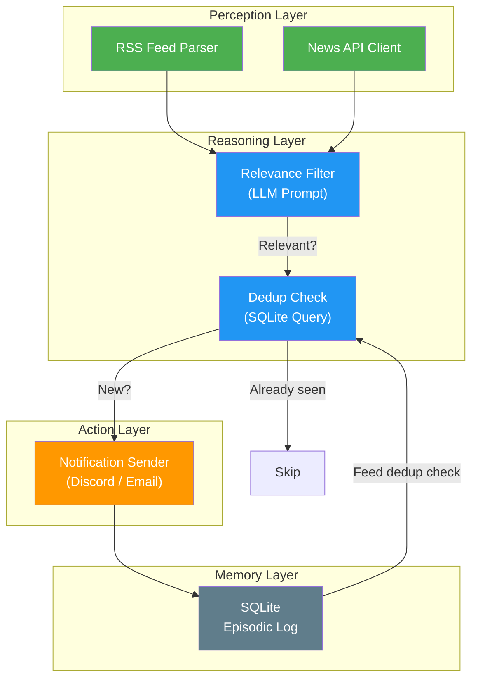

# Project 1 — Stock/News Monitor 📈

> **Focus:** Perception, Reactivity, and the fundamental Agent Loop

---

## 🎯 Goal

Build an agent that continuously monitors a live data stream (news feeds / stock tickers) and alerts you when it detects something relevant — while avoiding duplicate alerts.

---

## 🧠 Concept Mapping

| Williams Concept | How This Project Teaches It |
|---|---|
| **Reactivity** | The agent must respond to environmental changes (new articles, price moves) in real time |
| **Perception** | Ingesting and filtering noisy RSS/API data into structured information |
| **Memory (Episodic)** | Tracking "already seen" items in SQLite to prevent infinite alert loops |
| **Action** | Sending notifications via Discord webhook or email |
| **Agent Loop** | The full Perceive → Reason → Act → Observe → Store → Repeat cycle |

---

## 🏗️ Architecture



---

## 📂 File Structure (Planned)

```
project-1-stock-monitor/
├── README.md              ← This file
├── src/
│   ├── main.py            ← Entry point, runs the agent loop
│   ├── perception.py      ← RSS/API data ingestion
│   ├── reasoning.py       ← LLM-based relevance filtering
│   ├── action.py          ← Discord/email notification sender
│   ├── memory.py          ← SQLite episodic log (dedup + history)
│   └── config.py          ← API keys, topics, thresholds
├── .env                   ← Secrets (gitignored)
└── requirements.txt       ← Dependencies
```

---

## 🔧 Component Breakdown

### Perception (`perception.py`)
- Parse RSS feeds using `feedparser`
- Optionally call a News API (e.g., NewsAPI.org, Google News RSS)
- Normalize raw data into a standard `Article` dataclass: `{title, summary, url, source, timestamp}`

### Reasoning (`reasoning.py`)
- Use Gemini API to classify each article: "Is this relevant to [TOPIC]?"
- Prompt template with few-shot examples for consistent classification
- Return a relevance score (0-1) and a short rationale

### Memory (`memory.py`)
- SQLite database with table: `seen_articles(id, url_hash, title, relevance_score, alerted, timestamp)`
- Before alerting, check if `url_hash` already exists
- Log every article (relevant or not) for later analysis

### Action (`action.py`)
- Send formatted alert via Discord webhook (`requests.post`)
- Include: title, summary, relevance rationale, source URL
- Rate-limit to avoid spam (max N alerts per hour)

---

## ✅ Success Criteria
- [ ] Agent runs a continuous loop (polling every N minutes)
- [ ] Correctly identifies relevant articles for a given topic
- [ ] Never sends duplicate alerts for the same article
- [ ] Logs all activity to SQLite for inspection
- [ ] Gracefully handles API failures (retry logic)

---

## 🎓 What You'll Learn
1. How the **Agent Loop** works in practice (not just theory)
2. Why **Perception** needs to be a noise filter, not just a data pipe
3. How **Memory** prevents degenerate agent behavior (infinite loops)
4. The importance of **idempotency** in the Action component
5. How to handle **failure modes** in each component gracefully

---

## Status: 🟡 Initialized
