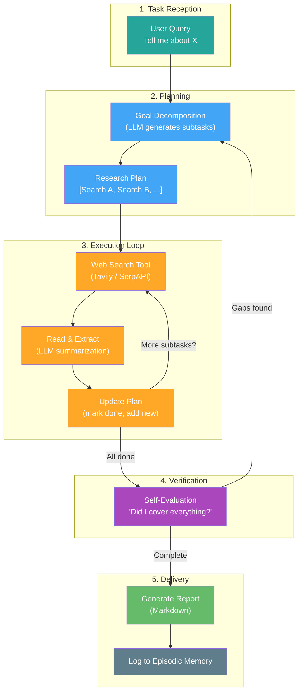

# Project 2 — Deep-Dive Researcher 🔬

> **Focus:** Proactivity, the 5-Phase Agent Lifecycle, and Planning

---

## 🎯 Goal

Build an agent that takes a broad, vague research request and autonomously produces a structured, comprehensive report — demonstrating goal decomposition, iterative execution, and self-verification.

---

## 🧠 Concept Mapping

| Williams Concept | How This Project Teaches It |
|---|---|
| **Proactivity** | Agent takes initiative — decomposes a vague goal into concrete subtasks without being told how |
| **Task Reception** | Receives a natural language research question |
| **Planning** | Decomposes the question into a multi-step research plan |
| **Execution** | Iteratively searches the web, reads results, and refines its plan |
| **Verification** | Self-evaluates: "Did I answer all parts of the original question?" |
| **Delivery** | Produces a formatted report and logs the run to episodic memory |

---

## 🏗️ Architecture



---

## 📂 File Structure (Planned)

```
project-2-deep-researcher/
├── README.md              ← This file
├── src/
│   ├── main.py            ← Entry point, orchestrates the lifecycle
│   ├── planner.py         ← Goal decomposition & plan management
│   ├── searcher.py        ← Web search tool integration
│   ├── synthesizer.py     ← LLM-based summarization & report generation
│   ├── verifier.py        ← Self-evaluation against original goal
│   ├── memory.py          ← Episodic log of research runs
│   └── config.py          ← API keys, model params
├── outputs/               ← Generated reports saved here
├── .env
└── requirements.txt
```

---

## 🔧 Component Breakdown

### Planner (`planner.py`)
- Takes a vague user query and uses the LLM to generate a structured research plan
- Plan format: list of `{subtask, status, search_queries, findings}`
- Supports dynamic re-planning when new information changes the scope

### Searcher (`searcher.py`)
- Wraps a web search API (Tavily, SerpAPI, or Google Custom Search)
- Returns top-N results with title, snippet, and URL
- Handles rate limits and retries

### Synthesizer (`synthesizer.py`)
- Takes raw search results and uses the LLM to extract key insights
- Builds a running "findings" document that grows with each search
- Generates the final markdown report

### Verifier (`verifier.py`)
- Compares the findings against the original query
- Uses the LLM to identify gaps: "What aspects of the question are not yet covered?"
- Returns either "complete" or a list of missing subtasks to add to the plan

### Memory (`memory.py`)
- Logs each research run: query, plan, searches performed, final report, timestamp
- Enables future runs to reference past research ("I already looked into this last week")

---

## ✅ Success Criteria
- [ ] Agent decomposes a vague query into 3-5 concrete subtasks
- [ ] Iteratively searches and builds knowledge (not a single-shot answer)
- [ ] Dynamically updates its plan based on what it finds
- [ ] Self-verifies completeness before delivering
- [ ] Produces a well-structured markdown report
- [ ] Logs the entire run for future reference

---

## 🎓 What You'll Learn
1. How **Planning** works (and fails) — the hardest part of any agent
2. The difference between **reactive** (respond to input) and **proactive** (take initiative) behavior
3. How the **Verification** phase prevents premature delivery
4. Why **iterative execution** beats single-shot LLM calls
5. How **episodic memory** enables agents to build on past work

---

## Status: 🟡 Initialized
