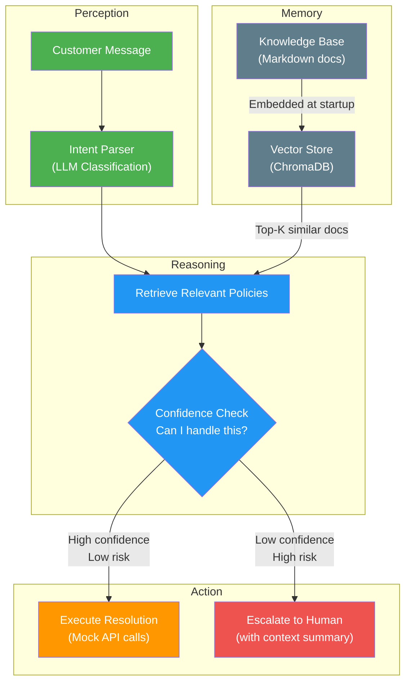
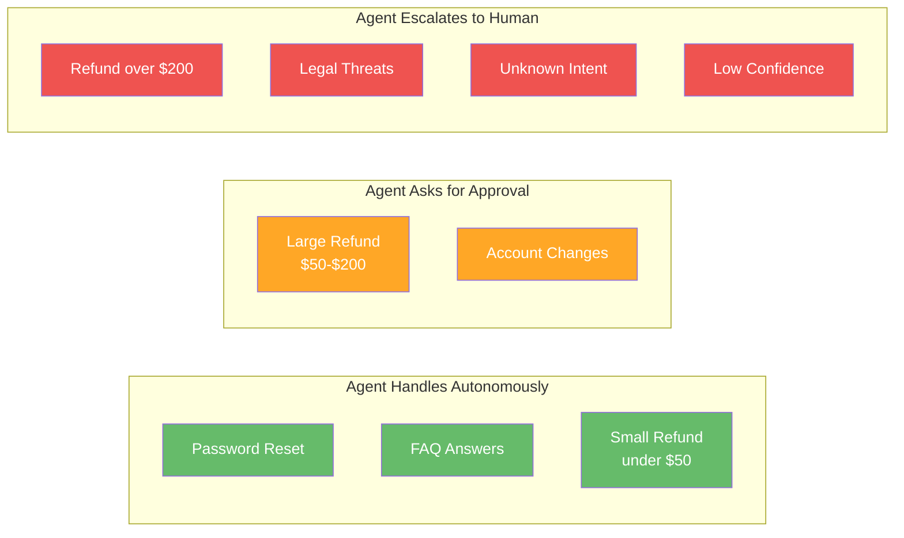

# Project 3 — Customer Support Router 🎧

> **Focus:** The Autonomy Spectrum, Memory (Vector Stores), and Escalation Logic

---

## 🎯 Goal

Build an agent that attempts to resolve customer support tickets using a knowledge base, but knows its own limits — escalating to a human when confidence is low or the action is high-risk.

---

## 🧠 Concept Mapping

| Williams Concept | How This Project Teaches It |
|---|---|
| **Autonomy Spectrum** | Agent handles routine queries autonomously, escalates edge cases |
| **Memory (Semantic)** | Vector store of knowledge base articles for retrieval |
| **Perception** | Parsing and understanding customer messages |
| **Reasoning** | Matching query to KB, deciding action vs. escalation |
| **Action** | Executing resolutions (refund, password reset) or escalating |
| **Verification** | Confirming the resolution addresses the customer's actual issue |

---

## 🏗️ Architecture



---

## 📂 File Structure (Planned)

```
project-3-support-router/
├── README.md              ← This file
├── knowledge-base/
│   ├── refund-policy.md   ← Mock KB: refund rules
│   ├── password-reset.md  ← Mock KB: password reset steps
│   ├── billing-faq.md     ← Mock KB: billing questions
│   └── escalation-rules.md ← When to escalate vs. resolve
├── src/
│   ├── main.py            ← Entry point, chat loop
│   ├── perception.py      ← Message parsing & intent classification
│   ├── memory.py          ← ChromaDB vector store management
│   ├── reasoning.py       ← Retrieval + confidence-based decision making
│   ├── action.py          ← Resolution execution & escalation
│   └── config.py          ← Confidence thresholds, model params
├── .env
└── requirements.txt
```

---

## 🔧 Component Breakdown

### Knowledge Base (`knowledge-base/`)
- 3-4 markdown documents simulating a company's support KB
- Cover: refund policy, password resets, billing FAQs, escalation rules
- Embedded into ChromaDB at startup

### Perception (`perception.py`)
- Parse customer message into structured intent
- Use LLM to classify: `{intent, urgency, sentiment, entities}`
- Example: "I want my money back for order #1234" → `{intent: "refund", urgency: "medium", order_id: "1234"}`

### Memory (`memory.py`)
- Initialize ChromaDB collection from knowledge base docs
- Chunk documents into meaningful segments
- Provide `retrieve(query, top_k)` function

### Reasoning (`reasoning.py`)
- Retrieve relevant KB articles based on classified intent
- Combine: customer message + relevant policies + escalation rules
- LLM decides: `{action: "resolve" | "escalate", confidence: 0-1, rationale: "..."}`
- **Escalation triggers:**
  - Confidence below threshold (e.g., < 0.7)
  - High-risk actions (refund > $100)
  - Sentiment is angry/threatening
  - No relevant KB articles found

### Action (`action.py`)
- **Resolve:** Call mock API functions (`process_refund()`, `reset_password()`)
- **Escalate:** Package context summary for human review:
  - Original message, classified intent, retrieved policies, agent's uncertainty reason
- Log all actions to an audit trail

---

## The Autonomy Spectrum in This Project



---

## ✅ Success Criteria
- [ ] Vector store correctly retrieves relevant policies for different intents
- [ ] Agent resolves simple queries without human intervention
- [ ] Agent escalates complex/risky queries with full context
- [ ] Confidence threshold is configurable and affects behavior visibly
- [ ] Audit trail logs every decision with rationale
- [ ] Agent never takes high-risk action without escalation

---

## 🎓 What You'll Learn
1. How to implement the **Autonomy Spectrum** — not binary, but graduated
2. Why **vector stores** are critical for grounding agent decisions in real data
3. How to design **escalation logic** that prevents overconfident failures
4. The difference between **semantic memory** (KB) and **episodic memory** (logs)
5. How to build **trust** in an agent by making its decisions auditable

---

## Status: 🟡 Initialized
