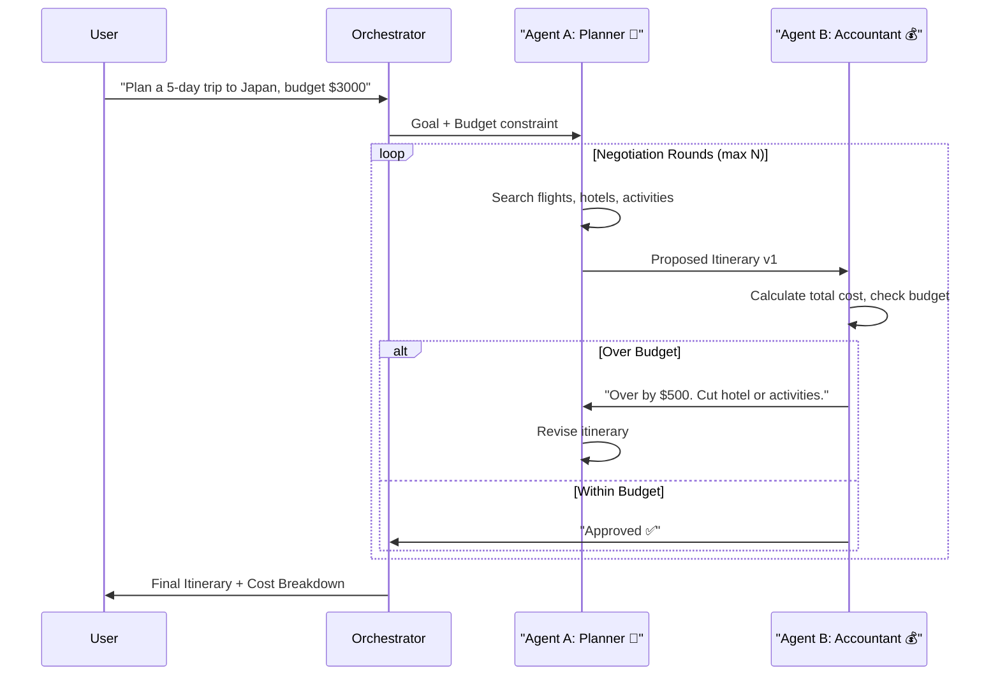
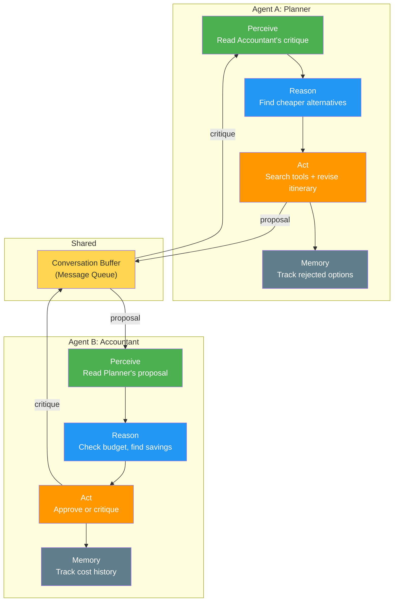

# Project 4 — Travel Agency (Multi-Agent) ✈️

> **Focus:** Social Ability, Multi-Agent Communication, and Collaborative Reasoning

---

## 🎯 Goal

Build a multi-agent system where two specialized agents — a Planner and an Accountant — must negotiate and collaborate to produce a travel itinerary that is both luxurious and budget-friendly.

---

## 🧠 Concept Mapping

| Williams Concept | How This Project Teaches It |
|---|---|
| **Social Ability** | Two agents must communicate, negotiate, and reach consensus |
| **Autonomy** | Each agent operates independently within its domain |
| **Reasoning** | Each agent reasons from its own objectives (luxury vs. budget) |
| **Memory** | Conversation buffer between agents tracks negotiation history |
| **Agent Loop** | Each agent runs its own loop, responding to the other's output |

---

## 🏗️ Architecture



---

## 📂 File Structure (Planned)

```
project-4-travel-agency/
├── README.md              ← This file
├── src/
│   ├── main.py            ← Entry point, orchestrator
│   ├── planner_agent.py   ← Agent A: itinerary creation
│   ├── accountant_agent.py ← Agent B: budget review
│   ├── tools.py           ← Mock travel search tools
│   ├── conversation.py    ← Inter-agent message passing
│   ├── memory.py          ← Negotiation history log
│   └── config.py          ← Budget limits, max rounds, model params
├── outputs/               ← Generated itineraries
├── .env
└── requirements.txt
```

---

## 🔧 Component Breakdown

### Orchestrator (`main.py`)
- Receives user request (destination, budget, duration)
- Initializes both agents with their respective system prompts
- Manages the negotiation loop (max N rounds)
- Detects convergence (agreement) or deadlock (no agreement after N rounds)
- Delivers final itinerary to user

### Planner Agent (`planner_agent.py`)
- **Personality:** Optimistic, wants the best experience
- **Tools:** `search_flights()`, `search_hotels()`, `search_activities()`
- **Behavior:** Creates the most appealing itinerary possible, then revises when the Accountant pushes back
- **Memory:** Tracks which options were already rejected (avoid re-proposing)

### Accountant Agent (`accountant_agent.py`)
- **Personality:** Pragmatic, budget-focused
- **Tools:** `calculate_total()`, `compare_alternatives()`
- **Behavior:** Reviews the Planner's proposal, identifies cost overruns, suggests specific cuts
- **Memory:** Tracks running negotiation history and cost trends

### Tools (`tools.py`)
- Mock travel search functions returning realistic dummy data
- `search_flights(origin, dest, date)` → list of flight options with prices
- `search_hotels(city, dates, stars)` → list of hotel options
- `search_activities(city)` → list of activities with costs
- `calculate_total(itinerary)` → total cost breakdown

### Conversation (`conversation.py`)
- Message format: `{sender, receiver, type, content, round}`
- Types: `proposal`, `critique`, `revision`, `approval`
- Maintains ordered conversation history accessible to both agents

---

## Multi-Agent Communication Flow



---

## ✅ Success Criteria
- [ ] Two agents with distinct personalities and objectives
- [ ] Planner creates proposals, Accountant critiques them
- [ ] Agents converge on an agreed itinerary within N rounds
- [ ] Conversation history is logged and inspectable
- [ ] Final output includes itinerary + cost breakdown + negotiation summary
- [ ] Deadlock detection (graceful failure if no agreement after max rounds)

---

## 🎓 What You'll Learn
1. How **Social Ability** works — structured inter-agent communication
2. Why **multi-agent debate** produces better results than a single agent
3. How to manage **conversation memory** across multiple agents
4. The role of the **Orchestrator** pattern in multi-agent systems
5. How **conflicting objectives** force agents to reason more carefully
6. The challenge of **convergence** — making sure agents actually agree

---

## Status: 🟡 Initialized
